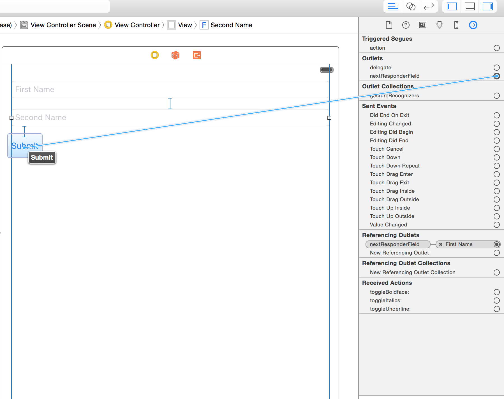
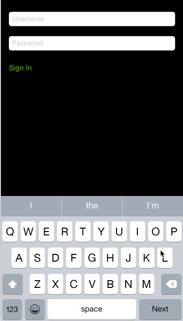

# NextResponderTextField

[](https://travis-ci.org/mohamede1945/NextResponderTextField)
[](http://cocoapods.org/pods/NextResponderTextField)
[](http://cocoapods.org/pods/NextResponderTextField)
[](http://cocoapods.org/pods/NextResponderTextField)


Represents a next responder UITextField.
When the instance becomes first responder, and then the user taps the action button (e.g. return keyboard key) 
then one of the following happens:
1. If no nextResponderField set, keyboard dismissed.
2. If nextResponderField is a UIButton and disabled, then keyboard dismissed.
3. If nextResponderField is a UIButton and enabled, then the UIButton fires touch up inside event (simulating a tap).

You can set nextResponderField to any UIResponder subclass, and it will become first responder when tapped.
But having multiple NextResponderTextField pointing to each other, then you can go to next field.

The typical usage will be list of NextResponderTextField and the last one point to a UIButton.

For example a login screen:
Username -> NextResponderTextField
Password -> NextResponderTextField
Sign In -> UIButton

Username.nextResponderField -> Password
Password.nextResponderField -> Sign In

## Requirements

- iOS 7.0+ / Mac OS X 10.9+
- Xcode 8.0
- Swift 2.3

## Usage

###### Interface builder:

1. Drag and drop a `UITextField`.
2. Change the class name to `NextResponderTextField` from identity inspector.
3. Change the Module name to `NextResponderTextField` from identity inspector.

3. Do the previous steps multiple times.
4. Wire each field with the next one like that

5. You can wire the last field with a UIButton to fire it.


###### Programmatically:
Alternatively, you can create it from code just as you create a normal UITextField
and set the nextResponderField property to the next UITextField or UIButton or even any UIResponder subclass.


#### Important

You can set the keyboard "Return Key" to anything (Done, Next, etc.)

## Demo


## Installation

**For iOS 8 or later:**

NextResponderTextField is available through [CocoaPods](http://cocoapods.org). To install
it, simply add the following line to your Podfile:

```ruby
pod "NextResponderTextField"
```

**For iOS 7.x:**

> Embedded frameworks require a minimum deployment target of iOS 8.

To use NextResponderTextField with a project targeting iOS 7, you must include NextResponderTextField.swift directly into your project.

## Author

Mohamed Afifi, mohamede1945@gmail.com

## License

NextResponderTextField is available under the MIT license. See the LICENSE file for more info.
